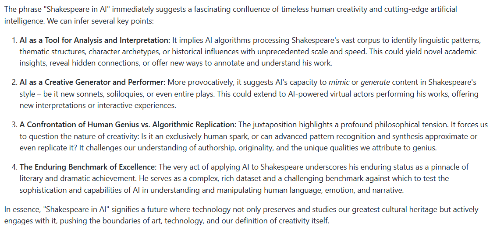

# Generative AI
Generative AI

# Screenshot

## content generation
input: "what can you infer from ‘Shakespeare in AI’? (max: 300 words)."

**content generated**

# Description

 Generative AI - experiments and best practices

- content generation
- chat completion
- ...

# Installation and Setup

- install vs code (if necessary)
- install pip, python (if necessary)
- install required packages:
  - pip install -r requirements.txt
- set environment variables
  - Gcp Api key
    - setx API_KEY "<your_api_key>"

# Tools 

AI, Google Cloud Platform (GCP), Azure, AWS, Python...

# Authors

@Ideaslink

# Acknowledgement

Google, Azure, AWS

# Version history
version 1.0.0.1

# License
MIT

